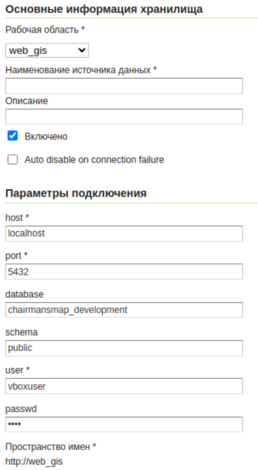
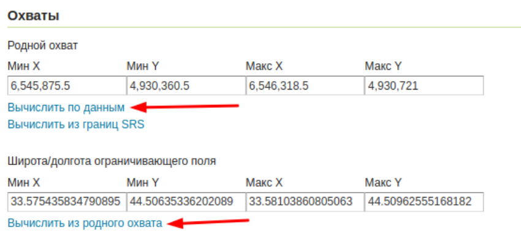

# Настройка geoserver

Тут показаны минимальные действия, необходимые для подключения карты из geoserver к приложению.
Они могут немного отличаться в зависимости от конфигурации машины.
Обращайте внимание на данные - пароли, названия могут быть индивидуальными


# Install

download a zip from [https://geoserver.org/download/](https://geoserver.org/download/)   
sudo unzip ./Downloads/geoserver-2.25.2-bin.zip -d /usr/share/geoserver  
sudo chown -R vboxuser /usr/share/geoserver/


# Uninstall

Delete the directory where GeoServer is installed.

sudo rm -rf /usr/share.geoserver


# Вход в geoserver

по дефолту user = "admin", password = "geoserver"


# Создание рабочей области

Рабочие области, “добавить новую рабочую область”.

* name: web_gis
* url: http://web_gis


# Создание хранилища

Зайти на страницу хранилищ, нажать на кнопку “Добавить новое хранилище”  
Необходимо выбрать тип хранилища. Для проекта chairmansmap выбрать PostGIS.
Указать:

* рабочую область созданную ранее
* наименование источника данных: village
* название бд (chairmansmap_development)
* имя пользователя в бд (vboxuser)
* пароль для бд (1234)
* check "Expose primary keys"

host, port, schema - оставить по умолчанию




# Публикация слоя

слои добавить новый слой выбрать хранилище опубликовать  
необходимо:

* задать название  
* настроить Контрольную систему координат при необходимости:  
  * Объявленная SRS - Plot::SRID (3857)
  * Обработка SRS - оставить объявленную  
* охват - “Вычислить по данным”, “Вычислить из родного охвата”	




# Конфигурация файла

code /usr/share/geoserver/webapps/geoserver/WEB-INF/web.xml  
В файле usr/share/geoserver/webapps/geoserver/WEB-INF/web.xml необходимо раскоментить:

* ENABLE_JSONP (44) для включения JSONP (text/javascript)  
* CORS для возможности доступа с локалки ([link](https://www.linkedin.com/pulse/install-geoserver-ubuntu-server-krishna-lodha)) :  
  * CORS in Jetty (143)  
  * cross-origin (197)


# Start

чтобы запустить отдельно
```bash
sh /usr/share/geoserver/bin/startup.sh
```

либо он запустится через Procfile
